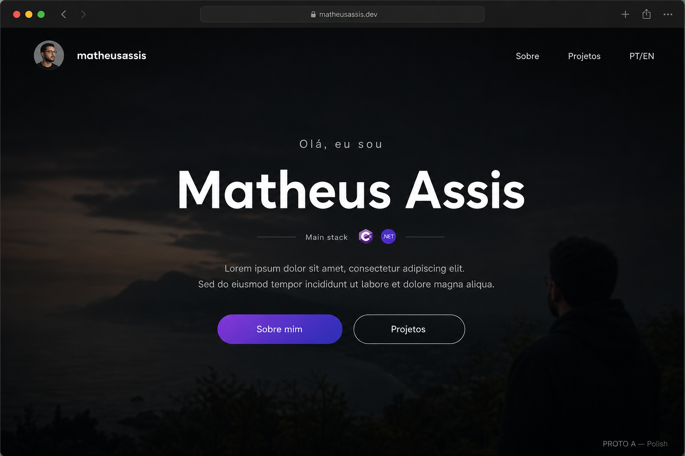
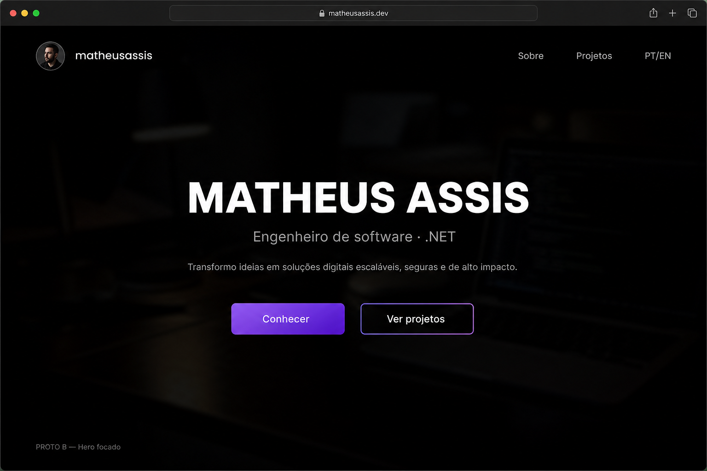
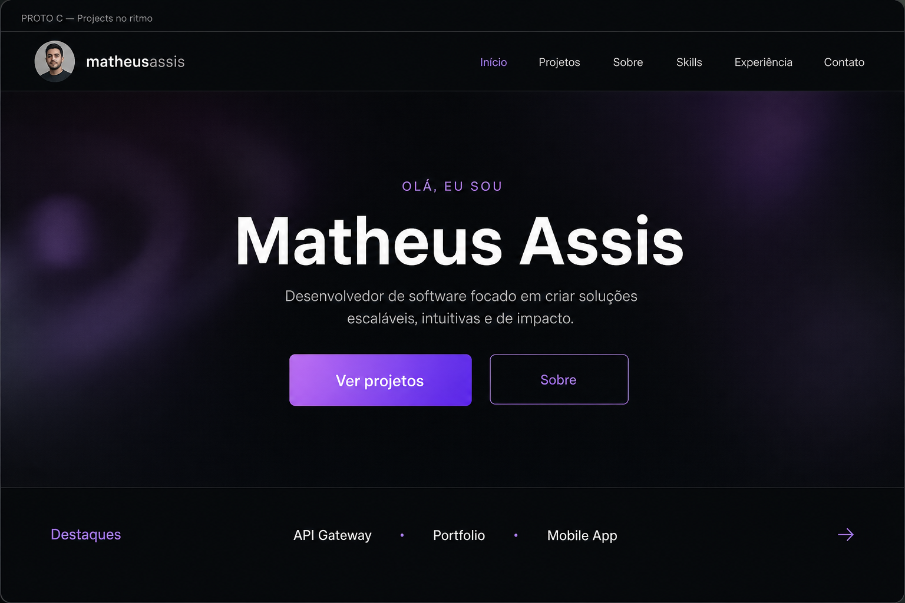

# Modernização de layout — protótipos (sem código)

**Papel:** agente UX  
**Data:** 2026-08-27  
**Meta:** modernizar a percepção visual **sem redesenhar** o site.

---

## Premissas

1. Manter dark theme, marca `matheusassis`, foto no header e acento roxo.
2. Manter a ordem das seções da Home e a página de Projects.
3. Mudanças são de hierarquia, espaçamento, tipografia e ritmo — não de conteúdo.
4. Este documento é só decisão/protótipo; implementação só quando você pedir.

---

## Diagnóstico rápido (estado atual)

| Área | O que funciona | O que envelhece um pouco |
|------|----------------|---------------------------|
| Hero | Nome forte, CTAs claros, fundo com atmosfera | Card “Main stack” compete com o nome; ícones C#/.NET sentem “widget” |
| Tipografia | Poppins ok no dark | Muitos pesos leves (200/300) diluem hierarquia |
| About | Bio + skills coerentes | Skill bars densas; CTAs duplicados (hero + about) |
| Projects | Busca + tags úteis | Cards podem parecer grade genérica de portfolio |
| Chrome | Header blur no scroll | Pouca diferenciação entre “topo da home” e resto |

**Princípio guia:** uma composição por viewport; nome/marca como sinal principal; menos caixas.

---

## Direção A — “Polish” (recomendado para começar)



**Ideia:** quase o mesmo layout; só refinamento de ritmo e tipografia.  
**Esforço:** baixo · **Impacto percebido:** médio

### O que muda
- Mais espaço vertical entre blocos do hero (nome ↔ texto ↔ botões).
- Nome um pouco maior / greeting mais discreto.
- Card de stack mais leve: menos padding, borda mais sutil, ou virar linha de ícones sob o subtítulo.
- Botões do hero com gap menor e alinhamento mais “editorial”.
- Seções abaixo: títulos com tracking/weight mais definidos; menos “cinza igual em tudo”.

### O que preserva
- Estrutura hero (saudação + nome + stack + texto + 2 CTAs).
- About, timeline, medium, projects intactos em estrutura.

### Wireframe — Home (1º viewport)

```
┌─────────────────────────────────────────────────────────┐
│  [foto] matheusassis              Sobre  Projetos  PT/EN │
│                                                          │
│                                                          │
│              Olá, eu sou                                 │
│              MATHEUS ASSIS                               │
│                                                          │
│           Backend · C#  .NET                             │
│           (ícones discretos, sem card pesado)            │
│                                                          │
│        texto de apresentação (1–2 linhas, centrado)      │
│                                                          │
│              [ Sobre mim ]   [ Projetos ]                │
│                                                          │
│                          ▽                               │
└─────────────────────────────────────────────────────────┘
```

### Por que funciona
Moderniza a sensação (“mais ar, mais clareza”) sem o visitante achar que é outro site.

---

## Direção B — “Hero focado”



**Ideia:** o 1º viewport vira uma composição só — marca/nome + uma frase + CTAs. Stack e detalhe descem para o About.  
**Esforço:** médio · **Impacto percebido:** alto (ainda incremental)

### O que muda
- Remove ou reduz o card `main-stack` do hero.
- Stack (C# / .NET) aparece como linha tipográfica ou só no About/Skills.
- Apresentação mais curta no hero (1 frase); o resto fica no About.
- Fundo continua full-bleed; conteúdo mais centrado e “limpo”.

### O que preserva
- Dark + gradiente nos botões + header.
- Mesmas seções; só redistribuição de ênfase no topo.

### Wireframe — Home (1º viewport)

```
┌─────────────────────────────────────────────────────────┐
│  [foto] matheusassis              Sobre  Projetos  PT/EN │
│                                                          │
│                                                          │
│                                                          │
│                   MATHEUS ASSIS                          │
│            Engenheiro de software · .NET                 │
│                                                          │
│         Uma frase curta sobre o que você faz.            │
│                                                          │
│              [ Conhecer ]    [ Ver projetos ]            │
│                                                          │
│                                                          │
└─────────────────────────────────────────────────────────┘

─── About (abaixo) ───
Bio + skills (inclui C#/.NET com mais contexto)
```

### Trade-off
Ganha clareza e “portfolio 2025+”; perde o atalho visual imediato das logos no primeiro olhar.

---

## Direção C — “Projects primeiro no ritmo”



**Ideia:** Home continua igual em espírito, mas o fluxo de atenção empurra mais cedo para prova de trabalho.  
**Esforço:** médio · **Impacto percebido:** médio–alto

### O que muda (conceitual)
- No hero, CTA primário = Projetos; secundário = Sobre.
- Opcional: strip mínima “destaques” (2–3 nomes de projeto, sem cards) entre Hero e About — só tipografia + link.
- Página Projects: hierarquia de título + filtros mais “toolbar”, cards com menos borda/sombra, mais foto/preview.

### Wireframe — ponte Hero → prova

```
│  ... hero ...                                            │
│  [ Ver projetos ]  (primário)   [ Sobre ] (secundário)   │
└─────────────────────────────────────────────────────────┘
┌─────────────────────────────────────────────────────────┐
│  Destaques    NomeProjeto · Outro · Terceiro        →    │
└─────────────────────────────────────────────────────────┘
│  About ...                                               │
```

### Trade-off
Site parece mais “work-first”. Só vale se os projetos forem o argumento principal (geralmente sim em portfolio).

---

## Projetos — 2 micro-protótipos (complementares a A/B/C)

### P1 — Grade mais calma
```
Projetos
busca .........................  [tag] [tag] [tag]

┌──────────────┐  ┌──────────────┐  ┌──────────────┐
│   preview    │  │   preview    │  │   preview    │
│              │  │              │  │              │
│ Título       │  │ Título       │  │ Título       │
│ tags leves   │  │ tags leves   │  │ tags leves   │
└──────────────┘  └──────────────┘  └──────────────┘
```
Menos moldura, mais imagem/título; tags sem “pill barulhenta”.

### P2 — Lista editorial (alternativa)
```
Projetos
busca · tags

Título do projeto ........................ 2024
uma linha de descrição · tags

Título do projeto ........................ 2023
uma linha de descrição · tags
```
Mais “revista”, menos “dashboard de cards”. Bom se quiser modernizar sem grid genérico.

---

## Motion (2–3 gestos, não fogos de artifício)

Compatível com qualquer direção:

1. **Entrada do hero:** nome e texto sobem levemente / fade (já pode existir parcialmente).
2. **Header:** blur/opacity no scroll (já existe — manter, só afinar timing).
3. **Seções:** reveal ao scroll nos títulos da timeline/about — uma vez, sutil.

Evitar: glow roxo forte, particles, hover exagerado em tudo.

---

## Priorização sugerida

| Prioridade | Item | Direção |
|------------|------|---------|
| 1 | Aliviar card de stack + tipografia do nome | A |
| 2 | Ritmo/spacing do hero e seções | A |
| 3 | CTA: Projetos como primário | C (opcional) |
| 4 | Simplificar hero (stack só no About) | B |
| 5 | Visual dos cards / lista de projects | P1 ou P2 |

---

## Decisão

- [x] Direção A — Polish → **[brief completo](./direcao-a-polish.md)**
- [ ] Direção B — Hero focado (descartada nesta rodada)
- [x] Direção C — Projects no ritmo → **[brief completo](./direcao-c-projects-ritmo.md)**
- [ ] Mix A + C implementados juntos: pendente confirmação do coordenador

**Próximo passo:** coordenador revisa os dois briefs; dev implementa (recomendado: **A primeiro**, depois **C**).

---

## Referência rápida do que NÃO mexer (nesta rodada)

- Conteúdo das traduções (salvo enxugar 1 frase do hero na B)
- i18n / rotas
- Admin
- Identidade de cor base (preto + roxo) — só calibrar opacidade/bordas
